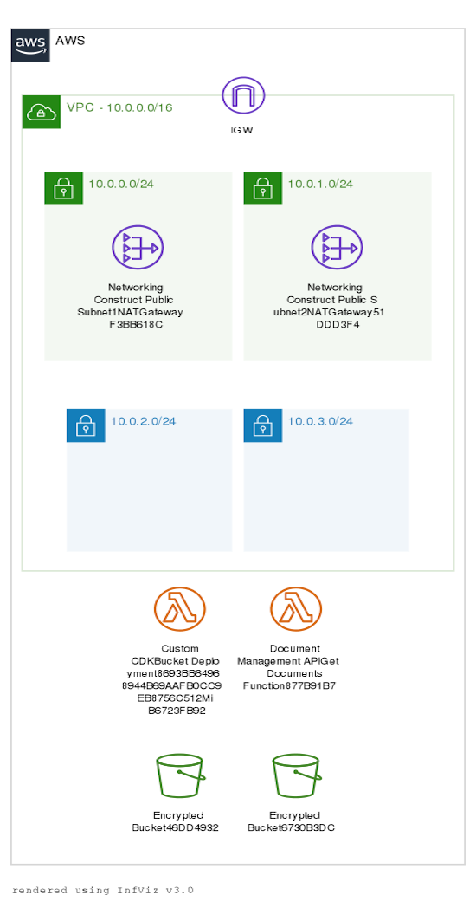

# AWS CDK TypeScript project

This demo AWS CDK app

* Creates a bare bones Typescript application using the CDK CLI `cdk init --language typescript`
* Creates a Lambda-based API using local assets
* Creates a Fargate-based web server using local assets
* Manages permissions and network access with the CDK

The `cdk.json` file tells the CDK Toolkit how to execute your app.

## Useful commands

 * `npm run build`   compile typescript to js
 * `npm run watch`   watch for changes and compile
 * `npm run test`    perform the jest unit tests
 * `cdk deploy`      deploy this stack to your default AWS account/region
 * `cdk diff`        compare deployed stack with current state
 * `cdk synth`       emits the synthesized CloudFormation template
